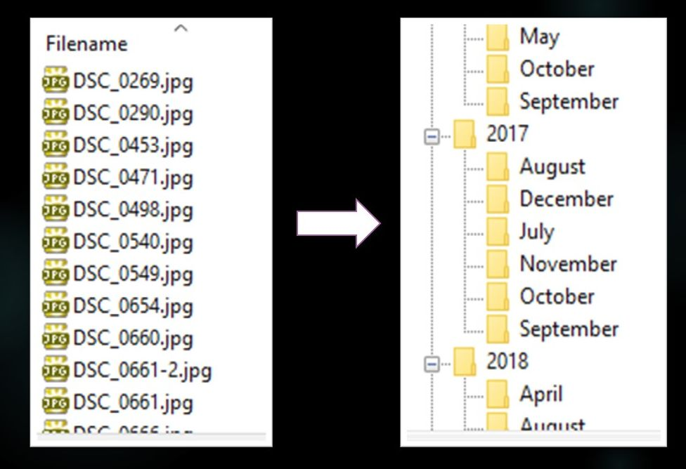

# PhotoSort

Sort Photos to folders based on exif data :

Find the actual capture date of the photo from the exif data and then sort the photos into folders based on year and month of that date.

Download : <https://github.com/aravindhms/PhotoSort/releases/download/pre-release/Photosort.exe>

GUI Screenshot:

External Libraries used:

ExifRead : <https://pypi.org/project/ExifRead/> \
PySimpleGUI : <https://pypi.org/project/PySimpleGUI/> 

ToDo:

Error handling.\
Folder structure options. --DONE
