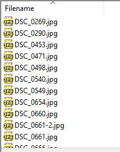
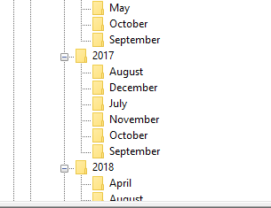
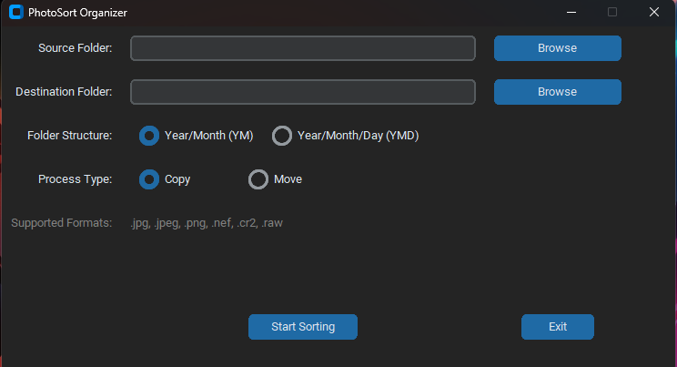

# 📸 PhotoSort

**PhotoSort** is a simple Python tool to organize your photos based on their EXIF metadata.  
It can automatically sort images into folders like `Year/Month` or `Year/Month/Day` using a friendly **GUI** or **command-line interface (CLI)**.

---

## ✨ Features

- ✅ Sort by photo capture date (EXIF)  
- ✅ Choose between `copy` or `move`  
- ✅ Organize into `Year/Month` or `Year/Month/Day` folders  
- ✅ Simple GUI with folder picker  
- ✅ Optional CLI for automation  
- ✅ Supports JPEG, JPG, PNG, RAW, NEF, CR2 formats  

---

## 🖼️ Screenshots

**Before Sorting** | **After Sorting**  
:--:|:--:  
 | 

**GUI:**

---

## 🚀 Installation

1. Clone or download this repo:

    `git clone https://github.com/your-username/PhotoSort.git`  
    `cd PhotoSort`

2. Install dependencies:

    `pip install -r requirements.txt`

---

## 🖥️ Usage

### 📌 Option 1: Graphical Interface (GUI)

Run the app using:

    python UI.py

- Browse for source and destination folders  
- Select folder structure and process type  
- Click "Start Sorting"

---

### 📌 Option 2: Command-Line Interface (CLI)

Run with:

    python main.py -s <source_path> -d <destination_path> -t <copy|move> -f <YM|YMD>

**Examples:**

    python main.py -s "E:/Camera/Unsorted" -d "E:/Camera/Sorted" -t copy -f YMD

---

## 📁 Folder Structure

    PhotoSort/
    ├── Screenshots/
    │   ├── before.png
    │   ├── after.png
    │   └── Screenshot.png
    ├── photosort.py          # Core logic (refactored)
    ├── UI.py                 # GUI (PySimpleGUI)
    ├── main.py               # CLI entry point
    ├── requirements.txt      # Dependencies
    ├── README.md             # This file
    └── tests/
        └── test_sorter.py    # Optional tests

---

## 🤝 Contributing

Pull requests are welcome! For major changes, please open an issue first.

---

## 📄 License

MIT License
