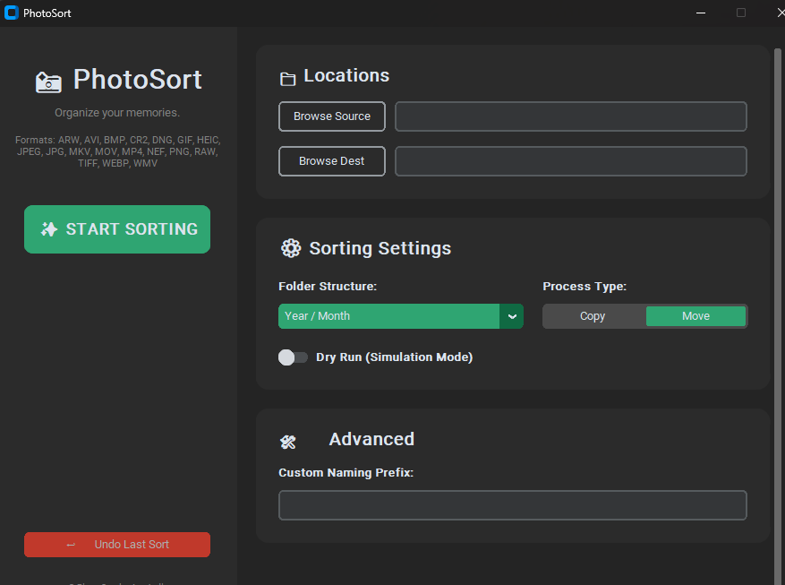

# PhotoSort 📸

A lightning-fast, ultra-safe, and highly customizable local photo organization tool. Built with Python and CustomTkinter, it organizes thousands of messy files into clean, readable folder structures based on their creation dates and file extensions.



## Why PhotoSort?

Sorting a massive library of photos and videos manually is a nightmare. PhotoSort automates this process entirely while prioritizing the safety of your data. 

- **Data Integrity First:** Features a **Safe Move** mode. Before it deletes the original file, it cryptographically hashes the new file to guarantee the bits transferred perfectly without corruption.
- **Dry Run (Simulation):** Not sure how the sort will turn out? Enable Dry Run to simulate the entire process and view exactly what folders will be created in the progress logs without touching a single file on your drive.
- **Smart Undo:** Made a mistake? Click **Undo Last Sort** to instantly pull every single photo back from their new destination folders to their exact original locations. It even recursively deletes the empty folders it created!
- **Cryptographic Deduplication:** Silently skips exact duplicates (based on file hashes) while smartly auto-renaming files that share a name but contain different images.

## Supported Formats

**Images:** `.jpg`, `.jpeg`, `.png`, `.gif`, `.webp`, `.heic`, `.tiff`, `.bmp`  
**RAWs:** `.nef`, `.cr2`, `.raw`, `.arw`, `.dng`  
**Videos:** `.mp4`, `.mov`, `.avi`, `.mkv`, `.wmv`  

## Folder Structures
Choose from a wide variety of organizational layouts:
1. **Year Only** (`2023`)
2. **Year / Month** (`2023/10`)
3. **Year / Month / Day** (`2023/10/25`)
4. **Year / Month Name** (`2023/October`)
5. **By File Extension** (`JPG`, `MP4`)
6. **Year / File Extension** (`2023/JPG`)
7. **Flat Directory** (No Subfolders)

## Download

Grab the latest standalone, portable `.exe` file (no installation required!) from the [Releases](https://github.com/aravindhms/PhotoSort/releases) page.

## Running Locally

To run the python script yourself:
```bash
python -m venv venv
.\venv\Scripts\activate
pip install -r requirements.txt
python app.py
```

## Contributing
Contributions, issues, and feature requests are welcome!

---
© PhotoSort by Aravindh
